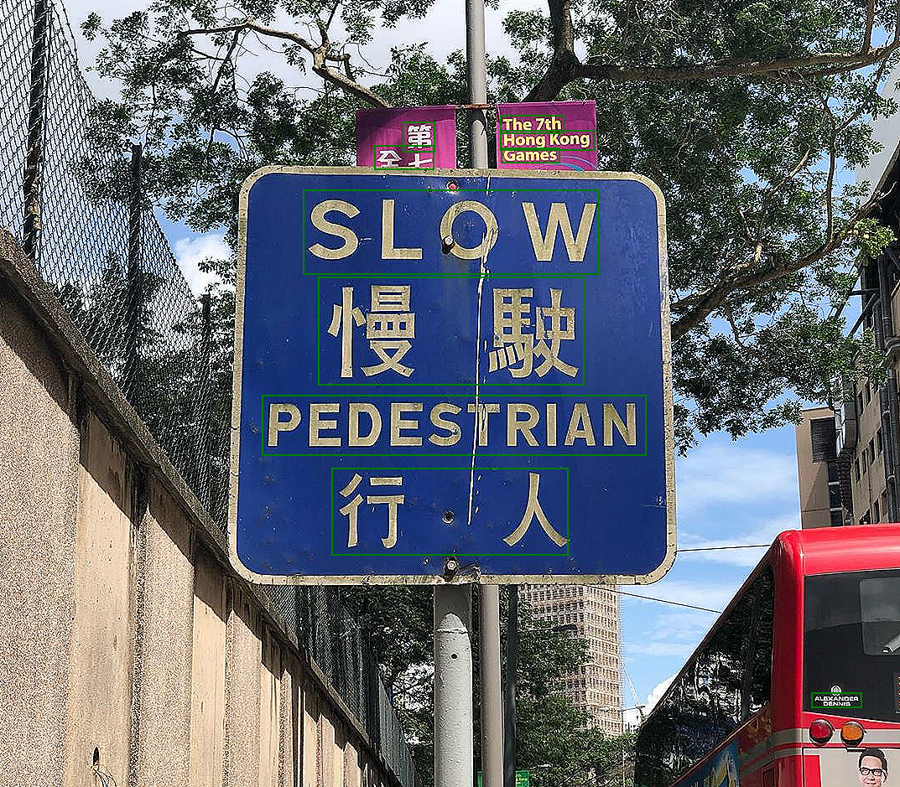
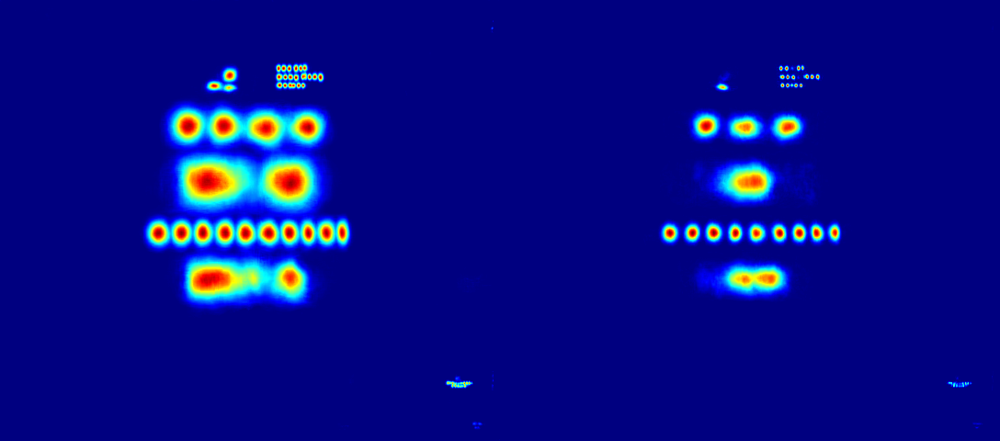

# Portfolio

## Text Detection

### Usage
`python3 pipeline/postprocessing.py`

The text detection model is from [this official repository](https://github.com/clovaai/CRAFT-pytorch).

The postprocessing part is refactor from [easyocr](https://github.com/JaidedAI/EasyOCR).

If you want to modify argument, modify `args/detection_args.yaml`.

Download pretrained model from [here](https://github.com/clovaai/CRAFT-pytorch#test-instruction-using-pretrained-model), and put the model to `pretrained_model`

### Result

The bounding box with image.

The heatmap from CRAFT.

### Acknowledgment

Thanks [CRAFT](https://github.com/clovaai/CRAFT-pytorch) and [EasyOCR](https://github.com/JaidedAI/EasyOCR)!

These toy project is based on these two repos.